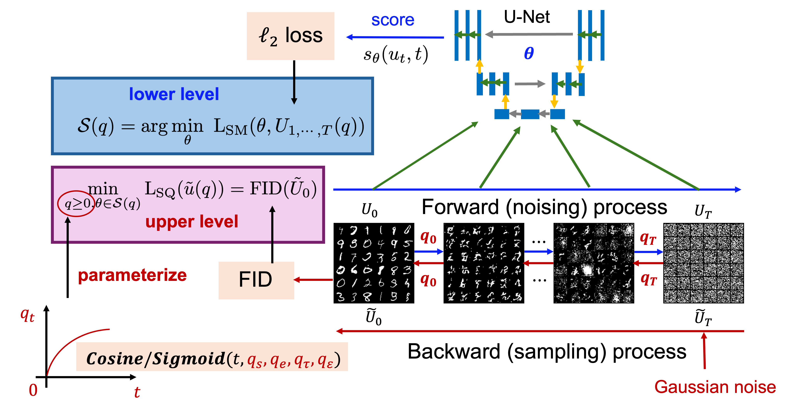

# Noise scheduler optimization for training MNIST diffusion


This is the codebase for bilevel hyperparameter optimization for noise scheduler in diffusion model training. (see [paper](https://arxiv.org/abs/2502.08808)). This implementation is built upon a lightweight diffusion model trained on MNIST: https://github.com/bot66/MNISTDiffusion.


## Introduction

<div align="center">
    
</div>
<br/><br/>

We optimize the noise scheduler jointly with the score network by formulating the task as a bilevel optimization problem. Given a fixed noise scheduler, we first generate forward samples and train the score network to predict the corresponding backward samples under the same scheduler. To update the noise scheduler, we approximate the gradient of the FID score of the generated images using the gradient of the penalty objective from the bilevel formulation. To reduce memory overhead, we employ a zeroth-order approximation for gradient estimation, avoiding backpropagation through the backward process. This approach enables the model to automatically learn an optimal noise scheduler that minimizes the FID score. Finally, we evaluate the model using both FID and Inception Score (IS). 

## Training
Install packages
```bash
pip install -r requirements.txt
```
Start training 
```bash
python train_mnist.py
python train_mnist_bayesian.py 
python train_mnist_bilevel_ZO.py --inner_loop 10 --inner_loop_z 1 --gamma 1 --gamma_end 1 --lr_beta 0.05 0.05 1 0.05 --initial_epoch 2 --epochs 3
```
## Script descriptions and tuning guidelines

 `train_mnist.py`
Trains a diffusion model on MNIST using a **fixed noise schedule**. This serves as the **baseline training setup**.

 `train_mnist_bayesian.py`
Applies **Bayesian hyperparameter optimization** to improve the training dynamics and performance of the diffusion model.

 `train_mnist_bilevel_ZO.py`
Implements **our proposed bilevel with zero-order optimization (ZO) approach**, which learns the noise schedule automatically by solving a **bilevel optimization problem** with ZO gradient estimator.


Feel free to tuning training parameters, type `python train_mnist.py -h` to get help message of arguments.

For `train_mnist.py`, tune hyperparameter tau first and then start, end, and epsilon. 

For `train_mnist_bilevel_ZO.py`, tune gamma and learning rates for beta, and initial epoch (without learning hyperparmater) and epochs. 


## Citation
If you find our work interesting, please consider citing this paper:
```
@inproceedings{xiao2025first,
  title={A First-order Generative Bilevel Optimization Framework for Diffusion Models},
  author={Xiao, Quan and Yuan, Hui and Saif, AFM and Liu, Gaowen and Kompella, Ramana and Wang, Mengdi and Chen, Tianyi},
  booktitle={Proceedings of the 42nd International Conference on Machine Learning},
  year={2025}
}
```


